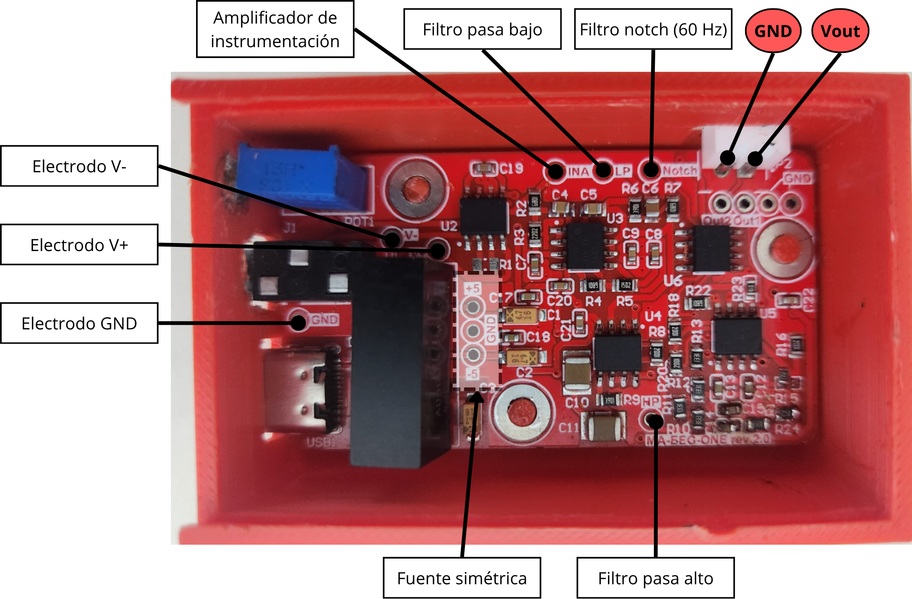

# 📦 EDUNUERA-X1

**EDUNUERA-X1** es un módulo educativo diseñado para adquirir señales electrofisiológicas (EEG, EMG y ECG) en aplicaciones de investigación y enseñanza. Combina hardware compacto con facilidad de uso y permite la captura, visualización y análisis de datos en tiempo real.



EDUNUERA-X1 se ofrece como un **módulo listo para laboratorio educativo**, con documentación completa y soporte técnico disponible.

📲 **¿Quieres adquirir el dispositivo?**

Solicita un módulo directamente por [**WhatsApp**](https://wa.me/593979287659?text=Hola%21+Deseo+adquirir+el+dispositivo+%2AEDUNUERA-X1)

---

## 🚀 Características destacadas

- ✅ Adquisición de señales EEG, EMG y ECG.
- 🛠️ Visualización y calibración de la señal con Arduino MEGA.
- 💾 Software de exportación de datos para **Matlab, Octave y Python**.
- 🧪 Incluye librería `ma_filter_smooth.h` para filtrado promedio móvil.
- 🩹 Diseño modular y seguro para laboratorio educativo.


---

## Tecnologías utilizadas

### Software:
- Librería **ma_filter_smooth** para filtrado de señales.
- Ejemplos en [**Arduino IDE**](https://github.com/estudiosma/eduneura/examples).

### Hardware ejemplo:
- Microcontrolador **Arduino MEGA**.
- Entrada analógica para señales biopotenciales.
- Alimentación ±3.3V o ±5V según versión.
- Conectores auxiliares para electrodos y prueba de señales.

---

## 🔌 Guía rápida de conexión

1. Alimenta la placa **EDUNUERA-X1** con 5V con un cable USB-C.
2. Conecta los electrodos a los puntos auxiliares (`V+`, `V-`, `GND`) según el manual.
3. Conecta la salida al Arduino MEGA (`Vout`, `GND`) según el manual. 
4. Carga el sketch de ejemplo en Arduino IDE.
5. Observa las señales en la interaz [**SerialHelp**](https://github.com/estudiosma/SerialHelp).
6. Ajusta la señal con el potenciómetro de la tarjeta.

---

## 📊 Análisis de datos con Matlab/Octave/Python

Ejemplo de cómo importar y graficar señales:

```matlab
%addpath('ma_functions'); % Descargar desde: https://github.com/estudiosma/matlab
data = readmatrix('test_signal.txt');
fs = 300; % Frecuencia de muestreo en Hz
t = (0:length(data)-1)/fs;
plot(t, data);
xlabel('Tiempo (s)');
ylabel('Amplitud');
legend("Ch_1");
